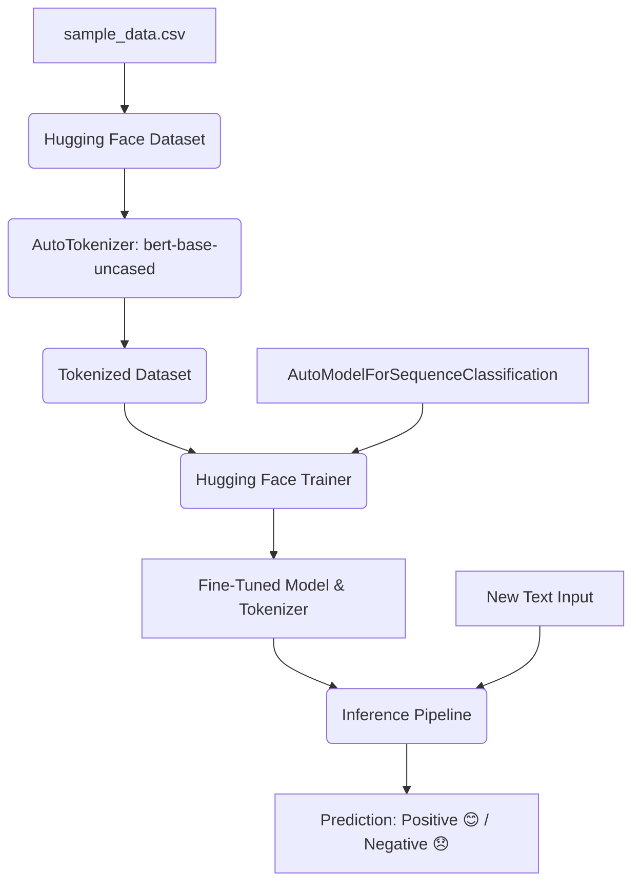

# Fine-Tune BERT for Sentiment Analysis 🚀

[](https://colab.research.google.com/drive/1nw3hlwQ74t-FHzRPlnUmjhkB97SY2fL-?usp=sharing)
[](https://huggingface.co/)
[](https://pytorch.org/)
[](https://opensource.org/licenses/MIT)

A complete, end-to-end pipeline to fine-tune a pre-trained **BERT (Bidirectional Encoder Representations from Transformers)** model for binary sentiment classification (Positive/Negative) using Hugging Face's `transformers` library, `datasets`, and PyTorch.

---

## 📌 Project Overview

This repository demonstrates how to perform transfer learning on `bert-base-uncased` using a custom dataset of customer reviews. The project includes:
1. **Dataset Generation:** Creating a custom synthetic dataset (`sample_data.csv`) featuring diverse positive and negative feedback.
2. **Preprocessing:** Tokenizing and mapping text data into input IDs and attention masks with dynamic padding and truncation.
3. **Fine-Tuning:** Leveraging Hugging Face's `Trainer` and `TrainingArguments` to fine-tune the BERT model.
4. **Model Saving:** Saving the fine-tuned model weights and tokenizer configuration.
5. **Inference Pipeline:** Building a quick classification pipeline to test custom inputs with formatted sentiment outputs (emoji-enabled).

---

## 🗺️ Pipeline Workflow

The diagram below illustrates the training and inference cycle of this project:



---

## 🛠️ Installation & Setup

To run this project locally, ensure you have Python 3.8+ installed. 

### 1. Clone the Repository
```bash
git clone https://github.com/Ravish-Paul/Fine-Tune-BERT.git
cd Fine-Tune-BERT
```

### 2. Install Dependencies
Install the required packages using `pip`:
```bash
pip install transformers datasets torch accelerate peft trl pandas
```

---

## 📂 Repository Structure

```directory
├── README.md              # Project documentation and guide
├── fine_tune_bert.ipynb   # Interactive Google Colab Notebook
├── fine_tune.py           # Standalone Python training script
└── sample_data.csv        # Custom sentiment dataset (positive/negative)
```

---

## 📊 Dataset Structure

The dataset contains short textual reviews labeled with binary sentiment targets:
- `1`: Positive sentiment 😊
- `0`: Negative sentiment 😞

Example entries from [sample_data.csv](file:///e:/Fine-Tune-BERT/sample_data.csv):
| Text | Label |
| :--- | :---: |
| `I love this movie` | `1` |
| `This product is amazing` | `1` |
| `The product is terrible` | `0` |
| `Poor customer support` | `0` |

---

## 🚀 How to Run

### Option A: Run on Google Colab (Recommended)
Simply click the badge below to run the interactive notebook directly in your browser:

[](https://colab.research.google.com/drive/1nw3hlwQ74t-FHzRPlnUmjhkB97SY2fL-?usp=sharing)

### Option B: Run Locally via Command Line
Execute the training script to generate the dataset, train the model, save it, and run sample inference:
```bash
python fine_tune.py
```

---

## 📝 Code Walkthrough

### 1. Load, Split and Tokenize Dataset
We load the dataset, perform a train-test split, and convert raw texts into model-readable token IDs:
```python
from datasets import load_dataset
from sklearn.model_selection import train_test_split
from transformers import AutoTokenizer

dataset = load_dataset("csv", data_files="sample_data.csv")
dataset = dataset["train"].train_test_split(test_size=0.2, seed=42)

tokenizer = AutoTokenizer.from_pretrained("bert-base-uncased")

def tokenise(example):
    return tokenizer(example["text"], padding="max_length", truncation=True)

tokenized_data = dataset.map(tokenise)
```

### 2. Fine-Tuning with Trainer
Initialize the model and set training parameters (10 epochs):
```python
from transformers import AutoModelForSequenceClassification, TrainingArguments, Trainer

model = AutoModelForSequenceClassification.from_pretrained("bert-base-uncased", num_labels=2)

training_args = TrainingArguments(
    output_dir="./results",
    num_train_epochs=10,
    per_device_train_batch_size=8
)

trainer = Trainer(
    model=model,
    args=training_args,
    train_dataset=tokenized_data["train"]
)

trainer.train()
```

### 3. Save Model & Run Inference
```python
# Save the model
model.save_pretrained("sentiment_model")
tokenizer.save_pretrained("sentiment_model")

# Load prediction pipeline
from transformers import pipeline
classifier = pipeline("text-classification", model="sentiment_model", tokenizer="sentiment_model")

# Get prediction
result = classifier("This product is fantastic")[0]
sentiment = "Positive 😊" if result["label"] == "LABEL_1" else "Negative 😞"
print(f"Sentiment: {sentiment} (Confidence: {result['score']:.4f})")
```

---

## 🎯 Sample Predictions & Output

After fine-tuning, the model outputs predictions structured as follows:

| Input Text | Predicted Sentiment | Confidence |
| :--- | :--- | :---: |
| "I absolutely love this product" | **Positive 😊** | `0.9821` |
| "This is the best phone I have ever used" | **Positive 😊** | `0.9754` |
| "I hate this movie" | **Negative 😞** | `0.9912` |
| "Terrible customer support" | **Negative 😞** | `0.9885` |

---
